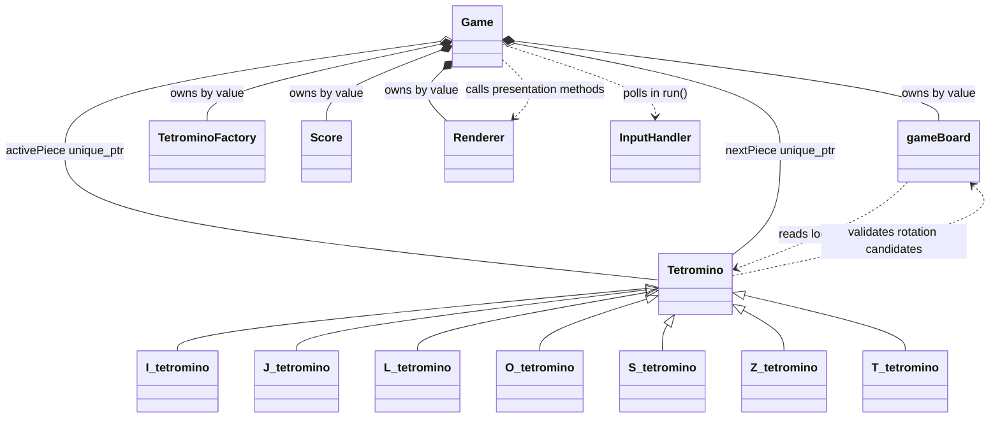

# Terminal-Tetris Project Documentation

## 1. Project Overview

Terminal-Tetris is a C++ object-oriented Tetris project intended for a
Windows CLI/terminal environment. The repository contains the core board,
piece, scoring, input, lifecycle, timing, and rendering interfaces. The
program entry point exists in `main.cpp`, but the Renderer methods are still
declarations only, so the complete executable does not currently link until a
Renderer implementation is provided.

The current implementation is organized around these subsystems:

- `Game`: owns the active game state and coordinates lifecycle operations.
- `gameBoard`: owns Board-space state, collision validation, movement, drops,
  locking, and row clearing.
- `Tetromino` and its seven derived classes: own local piece geometry and
  rotation candidates.
- `TetrominoFactory`: randomly creates derived Tetromino objects.
- `Score`: tracks score, cleared lines, and level.
- `InputHandler`: converts keyboard input into `GameAction` values.
- `Renderer`: declares the presentation interface but has no implementation.
- `main`: constructs a `Game` and calls `Game::run()`.

The implementation does not yet provide a complete playable terminal display:
the loop and input path exist, but rendering is not implemented and the
current loop has no sleep or frame limiter.

## 2. Repository Structure

Important files in the current repository:

| File | Responsibility |
|---|---|
| `game.hpp` | Declares `Game` ownership and public lifecycle/input/timing methods. |
| `game.cpp` | Implements construction, spawning, promotion, finishing, input dispatch, gravity, game-over checks, and the loop. |
| `gameBoard.hpp` | Declares Board state and Board-owned operations. |
| `gameBoard.cpp` | Implements movement, drops, locking, collision checks, and row clearing. |
| `tetromino.hpp` | Declares coordinates, rotation states, the base Tetromino, and seven derived classes. |
| `tetromino.cpp` | Implements the virtual destructor, const coordinate access, and transactional rotation helper. |
| `i_tetromino.cpp` | I-piece geometry and four rotation candidates. |
| `j_tetromino.cpp` | J-piece geometry and four rotation candidates. |
| `l_tetromino.cpp` | L-piece geometry and four rotation candidates. |
| `o_tetromino.cpp` | O-piece geometry and no-op rotation behavior. |
| `s_tetromino.cpp` | S-piece geometry and four explicit integer-coordinate states. |
| `z_tetromino.cpp` | Z-piece geometry and four explicit integer-coordinate states. |
| `t_tetromino.cpp` | T-piece geometry and four rotation candidates. |
| `tetrominoFactory.hpp` | Declares random Tetromino creation and factory-owned RNG state. |
| `tetrominoFactory.cpp` | Implements uniform selection of the seven piece types. |
| `score.hpp` | Declares score, line, and level state. |
| `score.cpp` | Implements scoring and level progression. |
| `inputHandler.hpp` | Declares `GameAction` and keyboard polling. |
| `inputHandler.cpp` | Implements Windows `_kbhit()`/`_getch()` input mapping. |
| `renderer.hpp` | Declares the presentation-only Renderer interface. |
| `main.cpp` | Constructs `Game`, calls `run()`, and returns. |
| `README.md` | Currently contains only the project title. |

There is no CMake, Makefile, or other build-system file in the repository.

## 3. Architecture

The intended and currently implemented ownership relationships are:



The lifecycle coordinator is `Game`:

```text
Game
├── gameBoard board
├── unique_ptr<Tetromino> activePiece
├── unique_ptr<Tetromino> nextPiece
├── TetrominoFactory factory
├── Score score
├── Renderer renderer
├── quitRequested
├── gameOver
└── gravity timing state
```

Responsibilities are separated as follows:

- `Game` decides when pieces are created, promoted, finished, and when input
  and gravity are processed.
- `gameBoard` owns Board coordinates, locked cells, collision tests, movement,
  drops, locking, and row clearing.
- `Tetromino` owns local geometry and rotation candidate generation.
- `TetrominoFactory` creates pieces and owns random selection state.
- `Score` owns score-related counters only.
- `InputHandler` reports actions and does not mutate gameplay state.
- `Renderer` is intended to observe state and display it. Its functions are
  not implemented yet.

## 4. Tetromino Architecture

`Tetromino` is an abstract base class with:

```cpp
coords pos[4];
int drop_speed;
Rotation rotation;
```

`pos[4]` is protected. The public accessors are:

```cpp
coords* getCoords();
const coords* getCoords() const;
```

The non-const overload exposes the underlying array for existing Board
operations. The const overload allows read-only consumers such as a future
Renderer to inspect the same array without copying it.

The seven derived classes are:

- `I_tetromino`
- `J_tetromino`
- `L_tetromino`
- `O_tetromino`
- `S_tetromino`
- `Z_tetromino`
- `T_tetromino`

Each constructor initializes four local coordinates, sets `drop_speed` to
zero, and sets `rotation` to `nil`, which represents the initial R0 state.
Each derived class implements `rotate(gameBoard&)` with explicit candidate
coordinate tables and calls the base `tryRotate()` helper.

The finalized R0 coordinate sets are:

| Piece | R0 local coordinates |
|---|---|
| I | `(-1,0), (0,0), (1,0), (2,0)` |
| J | `(0,-1), (0,0), (1,0), (2,0)` |
| L | `(0,-1), (-2,0), (-1,0), (0,0)` |
| O | `(0,0), (1,0), (0,1), (1,1)` |
| S | `(0,-1), (1,-1), (-1,0), (0,0)` |
| Z | `(-1,-1), (0,-1), (0,0), (1,0)` |
| T | `(0,-1), (-1,0), (0,0), (1,0)` |

I, J, L, S, Z, and T contain four explicit candidate states. O supplies the
same occupied cells during rotation, so its rotation is a no-op.

## 5. Coordinate System

The project uses two coordinate spaces.

### Local Tetromino coordinates

Each Tetromino has a conceptual local pivot P1 at `(0,0)`. The four entries
in `pos[4]` are integer offsets relative to P1:

```text
pos[i] = local offset of occupied cell i
```

These values are not Board coordinates.

### Board coordinates

`gameBoard` owns the Board-space pivot P2:

```cpp
coords pivot;
```

The absolute Board cell is calculated as:

```text
absolute cell = P2 + local offset
```

The Board provides:

```cpp
coords getPivot() const;
coords toBoardCoordinate(const coords& localOffset) const;
```

Example:

```text
P2 = (4, 1)
local offset = (-1, 0)
absolute cell = (3, 1)
```

Translation changes only P2. It does not rewrite `pos[4]`. Rotation changes
the local offsets and rotation state. It does not change P2.

Locked cells in `used_spaces` are already absolute Board coordinates.

## 6. Rotation System

The derived pieces use explicit orientation tables. The coordinate convention
is y-down Board geometry, and the intended clockwise mathematical transform
is:

```text
(x, y) -> (-y, x)
```

The source does not expose a public counter-clockwise operation. Rotation is
implemented as a clockwise state transition selected from each derived
class's explicit table.

Rotation flow:

1. A derived `rotate(gameBoard&)` chooses the next local candidate array.
2. It chooses the candidate `Rotation` enum value.
3. It calls `Tetromino::tryRotate()`.
4. `tryRotate()` converts every candidate local offset to a Board coordinate
   through `board.toBoardCoordinate()`.
5. It calls the read-only `board.canPlace()` with those absolute cells.
6. If validation fails, it returns `false` internally and does not modify
   `pos[]` or `rotation`.
7. If validation succeeds, it copies the candidate offsets into `pos[]` and
   updates `rotation`.

P2 is not changed by rotation. `used_spaces` is not changed by rotation.
There are no SRS wall kicks, fractional pivots, doubled coordinates, or
normalization translations.

O passes its unchanged occupied cells through the same transactional helper,
with its rotation state left unchanged.

## 7. Board

`gameBoard` stores:

```cpp
int length;       // initialized to 20
int breadth;      // initialized to 10
coords pivot;     // Board-space P2
vector<coords> used_spaces;
```

`used_spaces` is public and contains locked absolute Board coordinates.
Dimensions remain private but are readable through:

```cpp
int getLength() const;
int getBreadth() const;
```

The Board also exposes:

```cpp
coords getPivot() const;
void setPivot(const coords&);
coords toBoardCoordinate(const coords&) const;
bool canPlace(const coords*) const;
```

`canPlace()` checks exactly four candidate coordinates. It rejects a candidate
if any candidate equals a cell in `used_spaces`, or if any candidate lies
outside:

```text
0 <= x < breadth
0 <= y < length
```

It is `const` and does not modify Board state.

## 8. Movement

### Move left

`gameBoard::moveLeft(Tetromino*)` copies the current pivot, decrements the
candidate x coordinate, calculates four absolute candidate cells from the
candidate pivot and the Tetromino's local offsets, and calls `canPlace()`.
The actual pivot changes only if validation succeeds.

### Move right

`moveRight()` follows the same process with x increased by one.

### Soft drop

`softDrop()` creates a candidate pivot one row lower and validates its four
absolute cells. It returns:

- `true` and commits the pivot if movement succeeds.
- `false` if the pointer is null or the candidate is invalid.

The local geometry is never changed by movement.

### Hard drop

`hardDrop()` searches repeatedly using candidate pivots one row lower. It
commits the lowest valid pivot and then appends the four final absolute cells
to `used_spaces`.

## 9. Hard Drop and Locking

The exact successful hard-drop sequence is:

```text
current pivot and local offsets
    ↓
validate current absolute position
    ↓
test one-row-lower candidate
    ↓
repeat while candidate is valid
    ↓
commit lowest valid pivot
    ↓
convert final local offsets to absolute cells
    ↓
append four cells to used_spaces
```

If the current position is invalid, `hardDrop()` returns without changing the
pivot, local geometry, or `used_spaces`.

`Game::finishCurrentPiece()` uses this existing Board method rather than
duplicating locking:

```text
board.hardDrop(activePiece.get())
```

An important current limitation is that `Game::finishCurrentPiece()` proceeds
to row clearing, scoring, and promotion even if `hardDrop()` returned early
because the current position was invalid. There is no Boolean result from
`hardDrop()` to let Game distinguish those cases.

## 10. Row Clearing

`gameBoard::clearFullRows()` examines every row from `0` through `length - 1`
and every x coordinate from `0` through `breadth - 1`.

A row is full only when `used_spaces` contains a cell for every x coordinate
in that row.

When one or more rows are full:

1. Cells in full rows are removed.
2. Each remaining in-range cell keeps its x coordinate.
3. Its y coordinate is increased by the number of full rows below it.
4. Cells below cleared rows do not move.
5. All full rows are cleared in one call.
6. The function returns the number of cleared rows.

When no row is full, it returns `0` before replacing `used_spaces`.

The Board does not call `Score` itself. `Game::finishCurrentPiece()` receives
the returned count and passes it to `score.addLines(cleared)`.

## 11. TetrominoFactory

`TetrominoFactory` owns:

```cpp
std::mt19937 generator;
std::uniform_int_distribution<int> distribution;
```

The constructor seeds the generator with `std::random_device` and creates a
uniform distribution from 1 through 7.

The mapping is:

| Value | Created type |
|---:|---|
| 1 | `I_tetromino` |
| 2 | `J_tetromino` |
| 3 | `L_tetromino` |
| 4 | `O_tetromino` |
| 5 | `S_tetromino` |
| 6 | `T_tetromino` |
| 7 | `Z_tetromino` |

`createRandom()` returns `std::unique_ptr<Tetromino>`. The caller owns the
returned object. The factory does not retain created pieces.

The Board no longer creates pieces. `Game` requests pieces from the factory,
which keeps Board focused on Board-space state and validation.

## 12. Game Lifecycle

`Game` owns its Board, factory, Score, Renderer, and two Tetromino ownership
slots:

```cpp
std::unique_ptr<Tetromino> activePiece;
std::unique_ptr<Tetromino> nextPiece;
```

Construction:

1. Construct Board, empty pointers, factory, Score, Renderer, and state flags.
2. `initializePieces()` requests one active piece and one next piece.
3. `initializeSpawnPosition()` sets P2 to `(4,1)`.
4. It calculates the active piece's four absolute cells.
5. It validates them with `board.canPlace()`.
6. `gameOver` becomes true if the initial position is invalid.

Promotion:

1. `activePiece = std::move(nextPiece)`.
2. A replacement random piece is created for `nextPiece`.
3. P2 is reset to `(4,1)`.
4. The promoted active piece is validated.
5. `gameOver` becomes true if that spawn is invalid.

The intended lifecycle is:

```text
create active
    ↓
create next
    ↓
validate active at (4,1)
    ↓
gameplay and gravity
    ↓
hard drop / lock
    ↓
clear rows
    ↓
update Score
    ↓
promote next
    ↓
create replacement next
    ↓
validate promoted active at (4,1)
    ↓
continue or enter game-over
```

There is no restart or active/next accessor API.

## 13. Input System

`InputHandler` owns no gameplay state. It exposes:

```cpp
void initialize();
void shutdown();
GameAction pollAction();
```

The implementation is Windows-specific and uses `_kbhit()` and `_getch()`
from `<conio.h>`. Polling is non-blocking:

- If no key is waiting, `pollAction()` returns `GameAction::None`.
- If a key is waiting, it consumes and maps it.

Current mappings:

| Input | Action |
|---|---|
| A / a, Left arrow | `MoveLeft` |
| D / d, Right arrow | `MoveRight` |
| S / s, Down arrow | `SoftDrop` |
| W / w, Up arrow | `Rotate` |
| Space | `HardDrop` |
| Q / q, Escape | `Quit` |
| Other keys | `None` |

`InputHandler` does not call Board or Tetromino methods. `Game` receives the
action and dispatches it.

## 14. Game Loop

`Game::run()` currently executes:

```text
construct InputHandler
    ↓
input.initialize()
    ↓
renderControls()
    ↓
record steady_clock timestamp
    ↓
while quitRequested is false:
    pollAction()
    handleAction(action)
    read current steady_clock timestamp
    calculate elapsed duration in seconds
    updateGravity(deltaTime)
    render current state, or render game over once
    repeat
    ↓
input.shutdown()
```

Elapsed time is calculated with:

```cpp
std::chrono::steady_clock
std::chrono::duration<double>
```

`main.cpp` contains no gameplay logic:

```cpp
int main(){
    Game game;
    game.run();
    return 0;
}
```

The current loop polls non-blocking input continuously and has no sleep,
blocking wait, or frame limiter. Consequently, it can busy-spin and consume
substantial CPU while waiting for input.

## 15. Gravity

Game gravity state is:

```cpp
double gravityAccumulator;
double gravityInterval;
```

The constructor initializes:

```text
gravityAccumulator = 0.0
gravityInterval = 1.0 second
```

`updateGravity(deltaTime)`:

1. Returns for negative, NaN, or infinite `deltaTime`.
2. Adds valid delta time to the accumulator.
3. While the accumulator is at least one interval, calls
   `board.softDrop(activePiece.get())`.
4. On successful movement, subtracts one interval and continues.
5. On blocked movement, calls `finishCurrentPiece()`, resets the accumulator
   to zero for the newly promoted piece, and stops processing the old piece.

There is no level-based gravity or speed curve. The method is deterministic
with respect to the supplied elapsed duration, although the elapsed duration
in the real loop comes from the system clock.

## 16. Game Over

`Game` owns:

```cpp
bool gameOver;
```

It starts as `false`.

Game over is set when:

- The initial active piece cannot occupy its four cells at P2 `(4,1)`.
- The promoted active piece cannot occupy its four cells at P2 `(4,1)`.

The public query is:

```cpp
bool isGameOver() const;
```

After game over:

- `handleAction()` still accepts `Quit`.
- All other gameplay actions are ignored.
- `updateGravity()` returns immediately.
- The loop remains alive until Quit.
- `renderGameOver(score)` is called once by `run()`.

There is no restart, game-over menu, or game-over rendering implementation.

## 17. Score System

`Score` owns:

```cpp
int score;
int lines;
int level;
```

The constructor initializes:

```text
score = 0
lines = 0
level = 1
```

For a valid clear count:

| Lines cleared at once | Points |
|---:|---:|
| 1 | `100 * current level` |
| 2 | `300 * current level` |
| 3 | `500 * current level` |
| 4 | `800 * current level` |

Counts less than or equal to zero and counts greater than four are no-ops.

For 1–4 lines, the current level is used to calculate points first. Then the
total line count is increased, and level is recalculated:

```text
level = (total lines / 10) + 1
```

Thus lines 0–9 are level 1, lines 10–19 are level 2, and so on.

The public const getters are:

```cpp
int getScore() const;
int getLines() const;
int getLevel() const;
```

`Score` does not clear rows and does not control gravity.

## 18. Renderer Integration

The current Renderer interface is:

```cpp
class Renderer{
public:
    void render(const gameBoard& board,
                const Tetromino& activePiece,
                const Tetromino& nextPiece,
                const Score& score);

    void renderGameOver(const Score& score);
    void renderControls();
};
```

The header uses forward declarations and accepts gameplay state through const
references. Renderer does not own or mutate Board, Tetromino, or Score state.

`Game` owns a `Renderer renderer` by value and calls:

- `renderer.renderControls()` once when `run()` starts.
- `renderer.render(board, *activePiece, *nextPiece, score)` each normal loop
  iteration after input and gravity.
- `renderer.renderGameOver(score)` once after game-over is reached.

There is currently no `renderer.cpp`. Therefore these calls have no
definitions. The source can compile, but a full link currently fails with
undefined references to the three Renderer methods. No CLI drawing, ANSI
output, ncurses, colors, or other rendering library is implemented.

The Board and Tetromino public APIs now provide enough raw state for a future
Renderer:

- Board dimensions through `getLength()` and `getBreadth()`.
- Locked cells through public `used_spaces`.
- Active P2 through `getPivot()`.
- Local offsets through the const `Tetromino::getCoords()`.
- Absolute conversion through `toBoardCoordinate()`.
- Score/lines/level through Score getters.

Game itself does not expose its private Board, active piece, next piece, or
Score through getters. The current Game-to-Renderer calls work internally
because Game owns and passes those objects directly.

## 19. Full Runtime Flow

### Keyboard path

```text
keyboard
    ↓
InputHandler::pollAction()
    ↓
Game::handleAction(action)
    ├── MoveLeft  → board.moveLeft(activePiece.get())
    ├── MoveRight → board.moveRight(activePiece.get())
    ├── SoftDrop  → board.softDrop(activePiece.get())
    ├── Rotate    → activePiece->rotate(board)
    ├── HardDrop  → finishCurrentPiece()
    └── Quit      → quitRequested = true
```

### Automatic gravity path

```text
steady_clock timestamps
    ↓
deltaTime in seconds
    ↓
Game::updateGravity(deltaTime)
    ↓
board.softDrop(activePiece.get())
    ├── true  → subtract one interval
    └── false → finishCurrentPiece()
                    ↓
                hardDrop / lock
                    ↓
                clearFullRows()
                    ↓
                Score::addLines()
                    ↓
                promoteNextPiece()
```

### Presentation path

```text
Game state
    ↓
Renderer interface calls
    ↓
future terminal presentation
```

The final presentation step is currently only declared, not implemented.

## 20. Important Invariants

The current design relies on these invariants:

- `pos[4]` contains local Tetromino offsets, not absolute Board coordinates.
- P1 is the conceptual local origin `(0,0)`.
- P2 belongs to `gameBoard`.
- Absolute cells are P2 plus local offsets.
- Translation changes P2, not `pos[]`.
- Rotation changes local geometry, not P2.
- Locked cells in `used_spaces` are absolute Board coordinates.
- `canPlace()` is Board-owned and read-only.
- Candidate rotation is validated before local geometry is committed.
- Failed rotation leaves local geometry and rotation state unchanged.
- Successful soft drop commits only the Board pivot.
- `unique_ptr` owns active and next pieces.
- Factory-created pieces transfer ownership to Game.
- InputHandler reports actions but does not mutate gameplay state.
- Score does not control Board or gravity.
- Renderer is intended to be presentation-only.
- Game owns the lifecycle of active and next pieces.
- A normal Tetromino contains exactly four occupied coordinate entries.

One current lifecycle limitation is that Game does not receive a success result
from `hardDrop()`. `finishCurrentPiece()` always continues to clear, score,
and promote after calling it, even if Board rejected an invalid current
position and returned without locking.

## 21. Responsibility Matrix

| Component | Owns | Responsible for | Must not do |
|---|---|---|---|
| `Game` | Board, active/next unique pointers, factory, Score, Renderer, lifecycle flags, gravity state | Construction, input dispatch, timing, gravity coordination, finish/promotion, game-over state | Duplicate collision, rotation, locking, row-clearing, or scoring algorithms |
| `gameBoard` | Dimensions, P2, `used_spaces` | Board validation, movement, drops, locking, row clearing | Create Tetrominoes, own active-piece lifetime, calculate score |
| `Tetromino` | Local `pos[4]`, rotation enum, drop-speed field | Local geometry, candidate rotations, transactional rotation helper | Own P2, inspect `used_spaces`, decide Board movement |
| I/J/L/S/Z/T classes | Their explicit local geometry tables | Piece-specific R0–R3 candidate states | Own Board coordinates or lifecycle |
| `O_tetromino` | O local cells | Square geometry and no-op occupied-cell rotation | Move Board pivot or lock cells |
| `TetrominoFactory` | RNG and distribution | Uniform random derived-piece construction | Own pieces after returning them, control gameplay |
| `InputHandler` | No gameplay state | Key polling and `GameAction` mapping | Move pieces or modify Board directly |
| `Score` | Score, total lines, level | Point calculation and level progression | Clear rows, control gravity, render output |
| `Renderer` | No gameplay state | Declared presentation calls | Mutate Board, pieces, Score, or lifecycle |
| `main` | Local `Game` object | Program entry and `run()` invocation | Contain gameplay logic |

## 22. Important Design Decisions

### Board-owned P2

P2 changes during Board movement and remains stable during rotation. This keeps
Board-space placement and collision state together while leaving Tetromino
geometry local.

### Local Tetromino coordinates

Keeping `pos[4]` local means the same piece geometry can be validated at
different Board pivots without rewriting its shape during movement.

### Candidate rotation and `canPlace()`

Rotation is transactional: a derived piece proposes local coordinates, Board
validation checks their absolute positions, and the piece commits only after
success. This prevents partial invalid rotations.

### `unique_ptr`

The active and next pieces have one clear owner: Game. Moving `nextPiece` into
`activePiece` expresses promotion without raw owning pointers or manual
deletion.

### Factory

Random construction is outside Board. The factory centralizes the numeric
selection-to-derived-type mapping and keeps Board focused on occupied cells
and placement.

### Separate Score

Scoring state is independent from Board storage. Game is the coordinator that
passes the Board's cleared-row count to Score.

### Separate InputHandler

Input translation is independent from gameplay decisions. Game receives an
action and dispatches it to the appropriate existing component.

### Presentation-only Renderer

Renderer receives const references and is not intended to perform gameplay.
The current source establishes this boundary before adding terminal output.

### Game as lifecycle coordinator

Game is the place where creation, promotion, input, gravity, finishing, and
game-over state meet. Board and pieces do not need to know the complete game
lifecycle.

## 23. Compile / Run

There is no build system in the repository. The source tree is Windows-oriented
because `inputHandler.cpp` includes `<conio.h>`.

The complete source set can be compiled with C++14, but the current tree does
not link successfully because Renderer methods are declared in `renderer.hpp`
without definitions in `renderer.cpp`.

A representative complete build command is:

```text
g++ -std=c++14 -Wall -Wextra -pedantic \
game.cpp gameBoard.cpp score.cpp inputHandler.cpp \
tetromino.cpp tetrominoFactory.cpp \
i_tetromino.cpp j_tetromino.cpp l_tetromino.cpp \
o_tetromino.cpp s_tetromino.cpp z_tetromino.cpp t_tetromino.cpp \
main.cpp -o tetris
```

The expected current link errors are for:

```text
Renderer::render(...)
Renderer::renderGameOver(...)
Renderer::renderControls()
```

After a Renderer implementation exists, the resulting executable can be run
from the repository directory. At present, the loop waits for keyboard Quit
through the Windows console input path and has no implemented visual output.

## 24. Current Status

### Implemented

- Local Tetromino geometry for all seven pieces.
- Explicit rotation states and transactional rotation validation.
- Board-owned P2 and absolute-coordinate placement.
- Board movement and soft drop.
- Hard drop and locking.
- Read-only Board collision checking.
- Full-row detection, removal, and downward shifting.
- Random Tetromino factory with `unique_ptr` results.
- Game ownership of active and next pieces.
- Initial spawn and next-piece promotion.
- Score and level calculation.
- Input action translation.
- Deterministic gravity accumulator and fixed one-second interval.
- Game-over state and action/gravity gating.
- Game loop structure and program entry point.
- Renderer interface and Game integration points.

### Skeleton or incomplete

- `Renderer` has declarations only and no implementation.
- No terminal board drawing exists.
- No score or next-piece visual display exists.
- No game-over visual screen exists.
- No Game getters are provided for external observers.
- No Tetromino type identifier is provided for symbols or colors.
- No restart, pause, high-score persistence, or game-over menu exists.

### Known limitations

- `Game::run()` uses non-blocking input in a tight loop and has no sleep or
  frame limiter, so it may consume high CPU.
- The renderer integration currently prevents final linking until definitions
  are supplied.
- `finishCurrentPiece()` cannot tell whether `hardDrop()` actually locked an
  invalid current position because `hardDrop()` returns `void`.
- `used_spaces` is public and can theoretically contain duplicate or manually
  invalid coordinates if external code modifies it.
- Input handling is Windows-specific.
- The repository README does not document the current implementation or build.

## 25. New Developer Guide

If you are new to this project, read the files in this order:

1. `game.hpp` — see the top-level ownership and public lifecycle methods.
2. `game.cpp` — follow construction, input dispatch, gravity, finishing, and
   the main loop.
3. `gameBoard.hpp` — learn the Board API and P2 ownership.
4. `gameBoard.cpp` — inspect absolute-coordinate validation, movement, drops,
   locking, and row clearing.
5. `tetromino.hpp` — understand `coords`, `pos[4]`, rotation state, and the
   inheritance hierarchy.
6. `tetromino.cpp` — understand candidate rotation validation and transactional
   commit.
7. One simple piece such as `o_tetromino.cpp`, then `t_tetromino.cpp` and the
   remaining piece files for explicit geometry tables.
8. `tetrominoFactory.hpp` and `tetrominoFactory.cpp` — understand creation and
   ownership transfer.
9. `score.hpp` and `score.cpp` — understand line scoring and level progression.
10. `inputHandler.hpp` and `inputHandler.cpp` — understand action mapping and
    Windows console polling.
11. `renderer.hpp` — see the presentation boundary and the currently missing
    implementation.
12. `main.cpp` — confirm that program entry only constructs and runs Game.

When changing gameplay behavior, preserve the central coordinate invariant:

```text
absolute Board cell = gameBoard P2 + Tetromino local offset
```

When changing lifecycle behavior, keep ownership in Game and use the factory's
`std::unique_ptr<Tetromino>` results rather than adding raw owning pointers.
